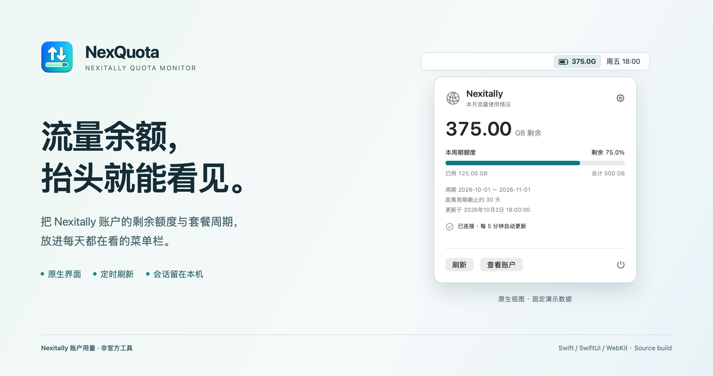

# NexQuota

> Nexitally account quota, right in your menu bar.


[简体中文](README.md) · [Usage guide](docs/USAGE.md) · [Design](docs/DESIGN.md) · [Privacy](docs/PRIVACY.md) · [Related projects](docs/RELATED_PROJECTS.md) · [Contributing](CONTRIBUTING.md)



NexQuota is a native macOS menu bar app for checking **Nexitally account usage**. Complete sign-in and provider verification through the built-in account window, then check remaining allowance, used traffic, and the billing cycle from the menu bar.

**A community-built, unofficial tool focused on a single Nexitally account.** This project is not affiliated with or endorsed by Nexitally. Configure your own HTTPS account usage page locally. Other providers need separate adapters. NexQuota displays the provider's metered traffic, refreshed every five minutes by default.

All documentation images use synthetic data. They do not connect to a real account. See [image provenance](docs/assets/README.md).

## Why

Checking quota should not require repeatedly opening a browser and searching an account dashboard. NexQuota keeps the remaining allowance, reset date, and freshness of the data together in a small panel.

Inspired by [CodexBar](https://github.com/steipete/CodexBar), the app uses Swift, SwiftUI, and WebKit to make quota visible while keeping the account session on the device.

## Features

- Remaining or used traffic in GB or percent, plus an icon-only mode.
- Total allowance, billing dates, days until the cycle ends, and capture time.
- Manual refresh and 1 / 5 / 15 / 30 minute polling; refresh after wake.
- A built-in account window for sign-in and provider verification.
- Last successful values retained when the connection fails, with visible status.
- A single native menu panel, outside-click / Escape dismissal, and launch at login.

## Screenshots

<table><tr><th>Usage</th><th>Settings</th></tr><tr>
<td valign="top"></td>
<td valign="top"></td>
</tr></table>

## Build from source

You need an Apple Silicon Mac, a Swift 6 toolchain, and the macOS SDK. Tests also require Node.js. The deployment target is macOS 13+; see [development notes](docs/DEVELOPMENT.md) for the tested environment and compatibility limits.

1. Download or clone this repository and enter the `NexQuota` directory.
2. Copy the sample configuration:

   ```bash
   cp Config.example.plist Config.local.plist
   ```

3. Edit `SiteURL` in `Config.local.plist` to your own HTTPS **account usage page**. `panel.example.com` is a placeholder. The local configuration is ignored by Git.
4. Build and test:

   ```bash
   ./build.sh
   ./test.sh
   ```

5. Open the project's `.build` directory in Finder and double-click `NexQuota.app`. Keep the app at a fixed location before enabling launch at login.

The build uses ad-hoc signing and does not require Apple Developer Program membership. Your local site configuration is embedded in your locally built app; do not publish private build artifacts.

## First use

Sign in through the app's account window and complete any provider verification yourself. When valid usage is shown, close the account window to let background polling resume. Click the menu bar item for details and the gear for preferences. Reopen the account window if the session expires.

Automatic reloads pause while the account window is visible. The app does not fill or collect password fields.

## Privacy

Parsing happens on your device. The project contains no custom relay or telemetry endpoint. The account webpage still connects to your provider and its own dependencies. WebKit manages its persistent local session; the app does not import browser cookies. Only usage values, billing dates, and capture time are cached.

See [privacy and data flow](docs/PRIVACY.md).

## Scope

The app interface is currently in Simplified Chinese. The first adapter supports Nexitally. Website changes may require parser updates. Metered traffic is not live network speed. Multiple accounts, history charts, notifications, and other providers are not implemented. Intel macOS, Windows, and Linux are outside this release's verified scope.

## Related projects

Subscription quota tools already exist. [SubStat](https://github.com/amirhp-com/SubStat) is a native macOS menu bar app that reads subscription response headers, with X-UI / 3X-UI HTML template support. [V2Ray Subscription Monitor](https://github.com/nimah79/v2ray-subscription-monitor) uses Go + Fyne and reads the same header format. [Mac-TrafficBar](https://github.com/Crossng/Mac-TrafficBar) reads local system network statistics for speed, traffic totals, and app rankings.

NexQuota focuses on Nexitally's account webpage, sign-in and verification, persistent local session, and billing-cycle data. Header-based tools may be simpler when a subscription exposes usable quota headers. We have not tested those tools against Nexitally. See [comparison and naming notes](docs/RELATED_PROJECTS.md).

## Documentation and contributions

[Usage](docs/USAGE.md) · [Design](docs/DESIGN.md) · [Architecture](docs/ARCHITECTURE.md) · [Development](docs/DEVELOPMENT.md) · [Related projects](docs/RELATED_PROJECTS.md) · [Changelog](CHANGELOG.md)

Please read [CONTRIBUTING.md](CONTRIBUTING.md) before submitting an issue or pull request. Use synthetic fixtures and redact private links and account details.

## License and acknowledgements

[MIT License](LICENSE). Thanks to [CodexBar](https://github.com/steipete/CodexBar) for the menu bar quota interaction inspiration. NexQuota uses its own name, icon, and implementation.
