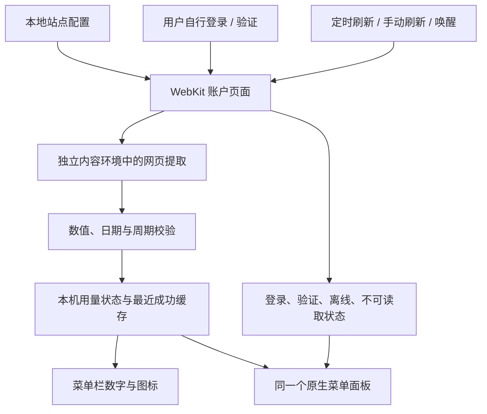

# 架构与数据流

[返回首页](../README.md)

## 模块职责

| 模块 | 职责 |
| --- | --- |
| `Configuration.swift` | 从 App 资源加载本地配置，验证 HTTPS 地址 |
| `WebSession.swift` | 维护 WKWebView 与账户窗口，加载网页，识别登录/验证/失败状态 |
| `usage-parser.js` | 从用量标签与周期文本提取数值，换算单位，拒绝不完整数据 |
| `Model.swift` | 用量模型、数值/日期校验、新鲜度与菜单栏格式化 |
| `Main.swift` | SwiftUI 界面、共享状态、定时刷新、菜单项与开机启动 |
| `MenuPanel.swift` | 唯一的菜单面板、键盘焦点、外部点击关闭与尺寸更新 |
| `MenuPlacement.swift` | 与 UI 解耦的屏幕坐标计算和边界约束 |

## 读取流程

没有 NexQuota 自建服务参与这一数据流。账户网页会按其自身逻辑请求服务商及第三方资源。

## 网页读取与会话

WKWebView 使用默认持久化网站数据存储，持有本机登录会话。页面读取脚本运行在命名的 `NexQuota.ReadOnly` 内容环境中，只返回已用、剩余、周期和读取时间。

读取逻辑会检测密码输入框是否存在以判断登录状态，读取网页正文以判断验证状态，但不获取密码字段的值。首次登录需要用户完成；不会绕过网站验证或关闭证书检查。

## 校验与新鲜度

JavaScript 层匹配已用/剩余标签，拒绝包含多个候选数值的单行、负值、缺失周期、倒序或越界日期。Swift 层再次验证有限数值、正总额、合法日期与时间范围。

新鲜度阈值为 `max(刷新间隔 × 2 + 60 秒, 180 秒)`。定时器每 15 秒检查是否到了下一次刷新时间；网络正在加载或账户窗口可见时跳过自动重载。

一次网页加载用 generation 标识，延迟结果如果属于旧加载就不再覆盖当前状态。网络失败会更新状态并保留最近成功值。

## 菜单面板与多屏

每个 App 实例只创建一个菜单面板。按钮动作把实际 sender 传入定位逻辑；快捷键与 App 重开使用状态栏按钮作为锚点。布局在屏幕可见区域内计算，支持屏幕原点为负值或垂直排列。

面板为非激活窗口，展开时不调用全 App 激活。账户和设置属于独立的普通窗口，只在用户执行对应操作时主动显示。

## 站点配置与扩展边界

公开源码只包含 `panel.example.com` 占位符。`Config.local.plist` 不纳入 Git，构建时作为 `SiteConfig.plist` 复制进本机 App。

当前 URL 可配置，但读取规则和登录页识别仍面向 Nexitally。新增机场需要适配数据来源、状态判断和对应测试；当前没有通用 provider 插件协议，未来应根据实际第二个适配的需求再抽取接口。
