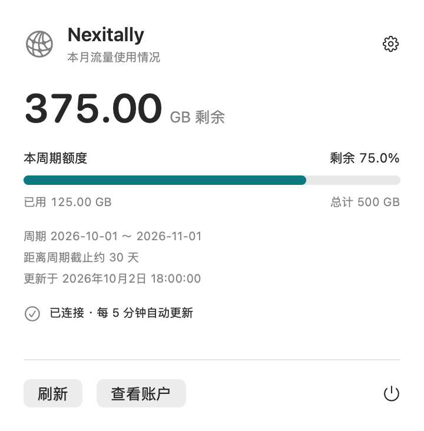
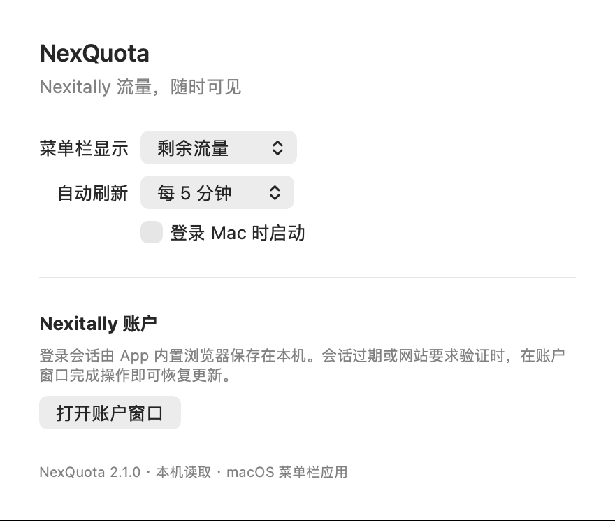
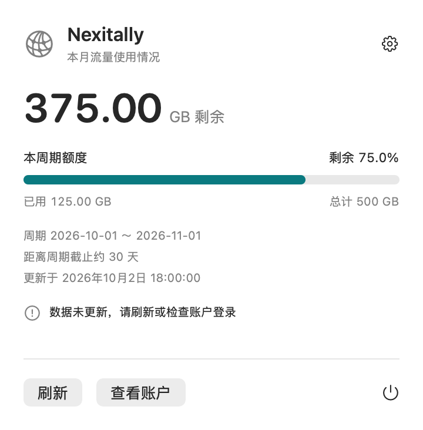

# 使用指南

[返回首页](../README.md)

## 准备自己的站点配置

复制根目录的 `Config.example.plist` 为 `Config.local.plist`，使用文本编辑器将 `SiteURL` 改为自己的 HTTPS 账户用量页地址。这个页面应能在登录后显示 Nexitally 的“已使用流量 / 未使用流量”和流量周期。

示例域名仅用于说明，不连接真实服务。配置文件已被 Git 忽略，编译时会复制进 App 的 `Contents/Resources/SiteConfig.plist`。修改地址后重新编译即可生效；请保留稳定的 App 路径和 Bundle ID，以便继续使用同一个本机会话。

站点地址可包含网站需要的查询参数。不要将账号或密码放进 URL；App 会拒绝带用户名、密码、片段标识的配置，并只允许 HTTPS 地址。

## 登录与后台运行

1. 从源码编译后，在 Finder 中打开 `.build/NexQuota.app`。
2. 首次连接需要登录时，账户窗口会打开。输入账户信息并完成网站要求的验证。
3. 读取成功后，菜单栏显示额度。点击图标可以查看面板。
4. 关闭账户窗口；窗口关闭后仍保留 WebKit 会话，后台刷新恢复。
5. 会话过期后，在面板中点击“登录账户”或“查看账户”，重新完成登录。

账户窗口打开时不会按定时间隔重新加载网页，但会观察页面是否已出现有效用量，避免打断你输入或验证。

## 查看流量

主数字显示剩余 GB，进度条表示剩余额度比例；下方展示已用、总额度、周期、截止天数和更新时间。所有数字来自服务商的账户页面，时间戳表示 App 读取到这一份数据的时间。

总额度由已用与剩余相加得到。单位按十进制换算：1 TB = 1000 GB，1 GB = 1000 MB。截止天数使用 Mac 当前日历和时区计算。

## 设置

- 菜单栏：剩余 GB / 剩余百分比 / 已用 GB / 已用百分比 / 仅图标。
- 自动刷新：每 1、5、15、30 分钟，默认 5 分钟。
- 开机启动：先把 App 放到固定目录，再启用“登录 Mac 时启动”。系统可能要求在“系统设置 → 通用 → 登录项”确认。

## 快捷键与关闭方式

| 操作 | 方式 |
| --- | --- |
| 展开或收起面板 | 点击菜单栏图标；App 接收键盘事件时可用 `Command + T` |
| 刷新 | 面板“刷新”按钮；`Command + R` |
| 查看账户 | 面板“查看账户”按钮；`Command + L` |
| 打开设置 | 齿轮；`Command + ,` |
| 关闭菜单面板 | `Escape`、点击外部或再次点击图标 |
| 退出 App | 面板电源按钮；App 接收键盘事件时可用 `Command + Q` |

这些快捷键不是全局热键。App 已运行时再次双击 App，仍使用同一个菜单面板；不会新建独立的流量窗口。

## 状态与常见问题

| 现象 | 含义与处理 |
| --- | --- |
| 正在更新流量 | 正在加载网站或等待有效数据；刷新按钮暂时不可用 |
| 请完成登录 / 网站需要验证 | 打开账户窗口，自行完成登录或验证 |
| 无法连接 Nexitally | 检查网络；保留最近一次成功数据，稍后自动重试或手动刷新 |
| 页面未提供流量数据 | 确认配置的是用量页、账户有有效套餐，或向项目反馈页面变化 |
| 菜单栏带 `!` | 读取失败，或数据已超过新鲜度阈值；查看面板状态和更新时间 |
| 数字与服务商暂时不同 | 服务商统计可能延迟；手动刷新后对照原始账户页 |

默认 5 分钟刷新时，超过 11 分钟未获得新数据会标为过期。其他间隔的阈值为“两个刷新间隔加 1 分钟”，最少 3 分钟。

## 升级与卸载

升级前先退出 App，再替换文件；已经运行的进程不会因为文件替换自动更新。网站配置变化后也需要重新编译。

NexQuota 的 Bundle ID 为 `local.nexquota.app`。从 TrafficBar 本机原型迁移时，首次运行需要在 NexQuota 的账户窗口重新登录；后续保持相同 Bundle ID，以复用 NexQuota 自己的本机会话。

卸载前关闭开机启动并退出 App，再移除 App 文件。删除 App 本身不保证清除 macOS 保存的 WebKit 网站数据或偏好；如需清理，先在服务商账户页退出登录，并按 macOS 的应用数据管理方式处理本机数据。
